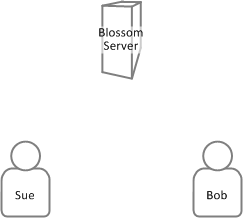
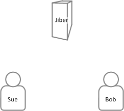

_Updated 28 Sep 2019: Jiber has been renamed to HiDB._

# A Starting Point
Platform Racing 2 is a game I wrote in 2007, and it is still alive and kicking today thanks to a dedicated and generous community of players. It's a multiplayer platformer with many great features, such as shooting your friends in the face with a laser gun. Here's how Platform Racing 2 works that out: (it runs on a multiplayer server called Blossom Server)

That's four steps. If we estimate that each step takes 100ms, then we're looking at waiting a whopping 400ms just to find out if we shot shomeone in the face or not. Surely we can do better!

# Getting Faster
[Jiber](https://github.com/jacob-grahn/hidb) is a modern multiplayer server for web games. It can run a copy of the game on the server, which speeds up some events considerably. Here's how Jiber works out the process of shooting your friend in the face:

That's two steps. If we stick with each step taking 100ms, then we'll be waiting 200ms to find out if we shot our friend in the face or not. Not bad... but can we do even better?

# Faster Still
That's right, Jiber is fast as crap! It sets up peer to peer connections between players, resulting in a face shooting process like this:

That's one step! Once Sue knows that Bob was at rest, she can deduce that she definitely shot Bob squarely in the face. We're looking at a 400% speed increase compared to Platform Racing 2.

# Ok, security
Jiber's peer to peer communication may be fast as crap, but what if people send fake updates to try to gain an unfair advantage? Jiber deals with this by checking every update with the confirmed server state, and rolling back any peer updates that turned out to be false. If a peer is found to be lying, any future updates from them can be ignored.

# Summary
I think of Jiber as the spiritual successor to Blossom Server, even though they really are not similar at all. I still get an email every now again from someone wanting to use Blossom Server. Now there is a much faster option for me to point them to.
