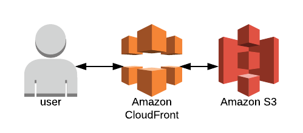
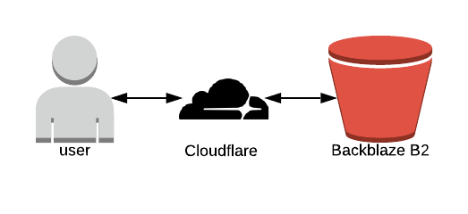

## S3
If you've been around the ol' static website hosting block a few times, you've
probably come across the possibility of hosting your site out of Amazon S3 and
maybe sticking Cloudfront in front of it for good measure. That stack looks
like the image below, assuming we use Amazon for everything.



## Buckets
The big three cloud providers all have their bucket solutions, which is to say
they all provide a way to store files without having
to worry about hard drives. Amazon's bucket service is called "S3" (short for
Simple Storage Service), Google's is called "Cloud Storage", and Microsoft's
is called "Blob Storage".

## B2
In recent years a new challenger has appeared, a
company called Backblaze has begun offering a service called "B2" that is wildly
cheaper than the competition. I'm always rooting for the underdog, so let's
take a look at hosting a static website from B2.

## Using B2 to Host a Site?
B2 does allow you to set a bucket to "public", and then provides a url where
anyone can download the files. That's a good start, but there are three problems
that stand between us and an awesome static website.
- 1: The url B2 providers isn't exactly something that would make for a catchy
website name.
- 2: Files served out of B2 don't have the right content-type headers present.
For example, if I type in the path to an index.html file hosted on B2, it
prompts me to download the html as a file, rather than rendering it as a
webpage.
- 3: There are some nice things that webservers tend to automatically do, like
serving an index.html file if the user requests a base path like "/"

Luckily we can solve all three issues using a cdn service called Cloudflare.
With that addition, our B2 static hosting stack looks like this:



## Cloud Workers
Cloudflare has a bunch of different services, but there's really only one we
need for this project: Cloud Workers. Cloud Workers let you write little
scripts that get called when a user requests a url. We'll be looking at the
url that the user requested, loading the specified file from B2, adding in
the right content-type headers, and then serving the file back to the user.
Here's the script I put together for the cloud worker:
```javascript
const baseUrl = "https://f000.backblazeb2.com/file/platformracing-com"

addEventListener('fetch', event => {
  event.respondWith(handleRequest(event))
})

/**
 * Return appropriate content type based on file name
 * @param {string} name
 */
function nameToType(name) {
  const arr = name.split('.')
  const extention = arr[arr.length - 1]
  const map = {
    html: 'text/html',
    js: 'application/javascript',
    css: 'text/css',
    woff2: 'binary/octet-stream'
  }
  return map[extention] || 'binary/octet-stream'
}

/**
 * Serve content from B2
 * @param {Request} request
 */
async function handleRequest(event) {
  // only allow get requests
  if (event.request.method !== 'GET') {
    return new Response('Method not allowed', { status: 405 })
  }

  // return a chached response if we have one
  const cache = caches.default
  let cachedResponse = await cache.match(event.request)
  if (cachedResponse) {
    return cachedResponse
  }

  // look for default index.html
  const url = new URL(event.request.url)
  let pathname = url.pathname
  if (pathname === '' || pathname === '/') {
    pathname = '/index.html'
  }

  // add some headers
  const headers = {
    'cache-control': 'public, max-age=14400',
    'content-type': nameToType(pathname)
  }

  // fetch content from B2
  const b2Response = await fetch(`${baseUrl}${pathname}`)
  const response = new Response(b2Response.body, { ...b2Response, headers })

  // return minimal error page
  if (response.status > 399) {
    return new Response(response.statusText, { status: response.status })
  }

  // all is well, return the response
  event.waitUntil(cache.put(event.request, response.clone()))
  return response
}
```

I'll admit, writing a somewhat complex script was not what I had in mind when
starting on the project. Sometimes experiments take us to strange places.

## Performance
Here are some completely un-scientific and un-trustworthy download speed results
for loading a 53kb javascript file:
- B2 Stack (Cache miss): 700ms
- B2 Stack (Cache hit): 239ms
- S3 Stack (Cache miss): 498ms
- S3 Stack (Cache hit): 230ms

In case you're wondering, "Cache miss" means that the file was not found at the
CDN layer. That's Cloudfront for the S3 stack or Cloudflare for the B2 stack.
Since the file is not found in the CDN, the CDN will load the file from the
origin and then serve it, usually with some kind of header indicating a
"cache miss". If the CDN has the file
it can provide it right away, resulting in a faster "cache hit".

## Cost
B2 is considerably cheaper than S3, but it's kind of like saying 0.00001 dollars
is ten times cheaper than 0.0001 dollars. Storage is so cheap that you probably won't care,
unless you're hosting large video files or something that will take up hundreds
of gigs of storage.

## Conclusion
As much as I would like to pull for the underdog, the S3 stack is considerably
easier to set up and use. S3's UI is nicer to use. S3 can serve your files
directly without needing to write a script that runs on every request.
The B2 stack is cheaper, but for small to medium sites the difference will be
negligible.
