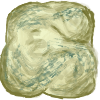

*Note: The source code to Bubble Racing and a living version of this tutorial can be found [here](https://gitlab.com/bubble-racing/bubble-racing-client/-/tree/master/wall).*

Bubble Racing is a game where you compete with friends to be the first to solve a maze (or obstacle course). There is no obstacle more tried and true than a wall. We're going to jazz up the visuals of our walls a little bit, but functionally what we're making here is an obstacle that things like bubbles can not pass through.

## Setup
Click `Scene` -> `New Scene` and then `Scene` -> `Save Scene As`. I named my scene `Wall` because I am creative, and put the scene in a folder called `wall` because I am audacious. Click `2D Scene` Under the `Create Root Node` section. Now, unless you want to make invisible walls (a totally valid choice), you will want to add an image that just screams "unpassable barrier". The sky is the limit here, but I went with a creative and audacious rock. Feel free to use my rock by downloading it and putting it in your `wall` folder.



Now here things get really advanced. Drag `rock1.png` from the `FileSystem` section into the middle-ish area. Congratulations! Your wall can be seen. I like to set the `x` and `y` position of things to exactly 0. You can do that by clicking on the `rock1` node and adjusting the position under the `Transform` section on the right.

<iframe width="560" height="315" sandbox="allow-same-origin allow-scripts allow-popups" src="https://tube.jigg.io/videos/embed/189a73e0-778e-43dc-b727-5b0875029759" frameborder="0" allowfullscreen></iframe>

## Physics
We're going to lean entirely on Godot's physics engine here. I do enjoy whipping out some maths and creating terribly buggy physics code, but as it turns out that is a real time sink and also usually a bad idea. First, add a StaticBody2D node, and then add a CollisionShape2D node inside of that. Click on the CollisionShape2D node and then set the Shape to `Rect` on the right menu. The rectangle this produces seems to default to 20 by 20, so set the `Scale` of the `CollisionShape2D` to `5` and `5` to get a 100 by 100 rectangle. Again, set `x` and `y` to 0 to make sure the collision rectangle matches up with the graphic you added in the last step.

<iframe width="560" height="315" sandbox="allow-same-origin allow-scripts allow-popups" src="https://tube.jigg.io/videos/embed/9a793fda-8f6c-435b-b090-790bba731bdd" frameborder="0" allowfullscreen></iframe>

## Lighting
Godot has a built in lighting system, and in Bubble Racing we're going to use it because we can. And because it looks cool. Our bubbles are going to produce light, and our walls are going to block light! Add a `LightOccluder2D` node to the scene. With the `LightOccluder2D` node selected, look for the `Polygon` field and click `PoolVector`. This next part is a little funky. In the `Size` field put 4. This will create inputs for 4 different points. Set the points as follows:
```
0: -50, -50
1: 50, -50
2: 50, 50
3: -50, 50
```
After you have some initial points in there, you can move the points around in the UI to fine tune things.

<iframe width="560" height="315" sandbox="allow-same-origin allow-scripts allow-popups" src="https://tube.jigg.io/videos/embed/00d9f749-6738-4018-ba20-6f0fceaf79d3" frameborder="0" allowfullscreen></iframe>

## Testing
1. Create a new scene in your `wall` folder called `WallTest`. Drag several instances of your wall into the scene. 

2. Next, we'll add something to bounce around on those walls of yours. Add a `RigidBody2D` node to your `WallTest` scene. Godot will complain that this `RigidBody2D` has no shape, so add a `CollisionShape2D` node as a child of the `RigidBody2D` node. Give the `CollisionsShape2D` node a Rect shape, and a scale of `5` by `5`.

3. To make this thing visible, I added a rock sprite to it. Rocks can fall, right?

4. To test that your walls will cast shadows, add a `Light2D` node to your `RigidBody2D` node. Drag a light map onto the `Texture` of the `Light2D` node. If you're wondering what a light map is, it's an image that tells Godot the shape and brightness of the light. Here's an image that will work: [bubble-light.png](bubble-light.png)

5. There are a bunch of settings on the light. One that you'll need to change for sure is to check the `Enabled` box under `Shadow`. Otherwise... you won't get any shadows and this test will look pretty sad. After messing around with the other settings under `Shadow`, these looked pretty decent:
```
Gradient: 10
Filter: PCF3
Filter Smooth: 40
```

6. A quirk of Godot is that lights don't really light anything up unless there is an image of something in the background. Rocks can be backgrounds, right? Drag a rock (an image of a rock, not an instance of your wall) into the scene and stretch it out to cover the whole screen.

7. You may notice that things seem pretty wildly bright. This is because we're taking a bright scene and making it even brighter with the light. To get things back into the visual range of normal humans, add a `CanvasModulate` node to the bottom of the scene's node list. Set the color of the `CanvasModulate` to something dark and brooding like `686868`. This will make your whole scene darker.

To run your test, click the `Play Scene` button on the top right. It looks like one of those things film people clap shut when they yell "Cut!" No idea what those are called, but that is what the button looks like. Also `F6` will work if you have no idea what I'm talking about.

<iframe width="560" height="315" sandbox="allow-same-origin allow-scripts allow-popups" src="https://tube.jigg.io/videos/embed/aed39eb8-99a2-4372-b649-9ccd56f351e5" frameborder="0" allowfullscreen></iframe>

## Congrats
Congratulations! You made a *wall*.

## Bonus
To be way more fancy than is needed, I made *3 rocks*, and added some code to randomize them some. The code is [here](Wall.gd) if you're interested in such things. Here's the final result:

<iframe width="560" height="315" sandbox="allow-same-origin allow-scripts allow-popups" src="https://tube.jigg.io/videos/embed/4e82aa78-15a1-470a-b27c-82965bba258f" frameborder="0" allowfullscreen></iframe>